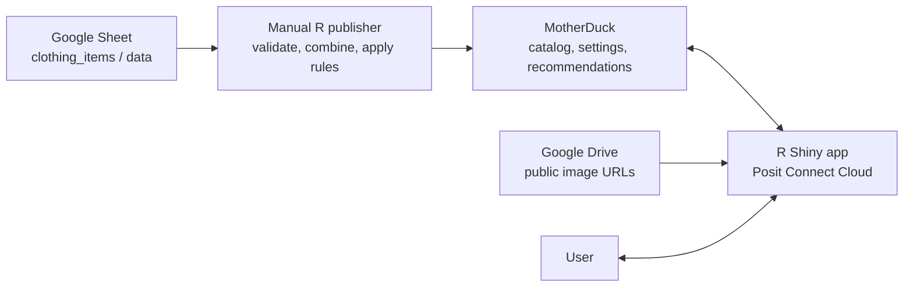
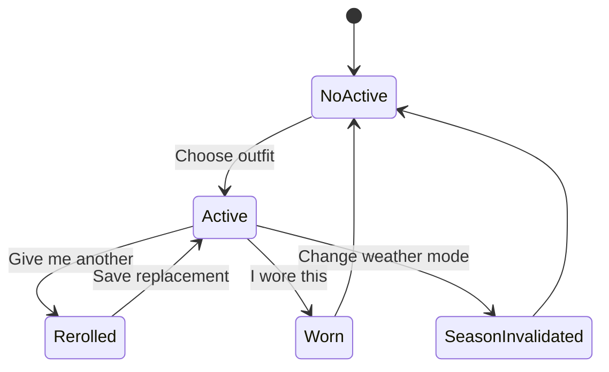

# Clothes App Design

*A Choco Trail project*

## Problem

Choosing a work outfit each morning takes time and creates some decision fatigue. The app will provide one suitable combination of a top, bottom, and shoes from a small personal wardrobe. Recommendations should offer variety while avoiding recently worn tops and combinations that do not match. The app will remember which recommendations were confirmed as worn so future choices remain useful.

## Scope

The first version is a single-user R Shiny app hosted publicly on Posit Connect Cloud. Its URL will not be promoted, and version one will not add application authentication. It will provide a mobile-friendly morning decision screen, a secondary wear-history view, a persistent warm/cold weather setting, rerolls, and confirmation of which recommendation was worn.

Version one will not manage laundry or temporary availability, use live weather or calendars, score favorites, plan future outfits, enforce bottom or shoe cooldowns, or provide wardrobe editing inside Shiny.

## Brand and Visual Direction

The app will follow the Choco Trail system documented in `../personal_brand/brand-guide/choco-trail-brand-essentials.md` and `../personal_brand/output/pdf/choco-trail-brand-guide.pdf`.

The interface should express quiet rigor, restrained character, and plainspoken experimentation. It should feel warm, clear, dependable, and personally made rather than corporate or generically technical. It will avoid gradients, decorative animation, oversized display type, heavy shadows, excessive rounding, and ornamental use of status colors.

### Typography

- **Recursive Sans Linear** is the interface and body typeface, using weights 400 and 500 with `CASL 0`, `MONO 0`, `slnt 0`, and `CRSV 0.5` when supported.
- **Azeret Mono** is reserved for timestamps, compact metadata, IDs, and tabular values.
- **Mina Bold** appears only inside the approved Choco Trail wordmark or rare brand-signature use. It is not an interface heading or body font.

Version one will load Recursive and Azeret Mono from Google Fonts rather than self-hosting the existing font files. If external font loading proves unreliable in the deployed app, self-hosting may be reconsidered later.

### Color tokens

| Token | Hex | App use |
|---|---|---|
| River Stone Paper | `#F4F3EF` | Page background |
| Ink | `#22292B` | Primary text and high-emphasis structure |
| Surface | `#E5E9E6` | Outfit cards, history rows, and quiet panels |
| Border | `#C1C9C5` | Dividers, card edges, and inactive controls |
| Muted | `#5F6969` | Nonessential supporting text only |
| Current Turquoise | `#2F6F73` | Primary action, links, focus, and selected states |
| Current Soft | `#DCE8E7` | Selected-control and information backgrounds |
| Comet Dust | `#8B5E62` | Rare expressive detail; never a competing primary action |
| Success | `#42634A` / `#E1E8DE` | Confirmed saves and completed wear actions |
| Warning | `#7A5B22` / `#EEE4CF` | Conditions requiring attention |
| Cinder Red | `#A24E3F` / `#F0DCD8` | Errors and destructive meaning only |

Neutrals will carry most of the interface. Color will always be paired with text, an icon, a border, or another non-color cue.

### Shape, spacing, and identity

- Surfaces use a 3-pixel corner radius; controls use 4 pixels.
- Ordinary cards remain flat, with borders rather than shadows.
- Spacing follows the compact 4, 8, 12, 16, 24, and 32 pixel rhythm.
- Pills are limited to genuine filters or statuses, including the warm/cold selector if implemented as a segmented control.
- Interactive targets should be about 44 by 44 CSS pixels and never smaller than 24 by 24 pixels without a clear reason.
- Keyboard focus uses Current Turquoise with a separating Paper gap. Body links are Current Turquoise and underlined.
- The approved Ink horizontal lockup may appear quietly in the footer at no less than 180 CSS pixels wide. The approved favicon asset will be used at smaller sizes; the lockup will not be redrawn.
- The app will use the existing clothing photography directly and will not add decorative stock imagery, cultural motifs, or AI-styled ornament.

## Technical Plan

The Google spreadsheet [`clothing_items`](https://docs.google.com/spreadsheets/d/1bJhNJWLV1vdM4jDoC6T2lUOMbBhPdkywE5tSejeauN0/edit?gid=0#gid=0), using its `data` tab, is the editable catalog. Its spreadsheet ID is `1bJhNJWLV1vdM4jDoC6T2lUOMbBhPdkywE5tSejeauN0`. A manually run R publishing process will validate that catalog, generate every possible top-bottom-shoes combination, apply compatibility rules, and publish the results to MotherDuck. The publisher will update catalog tables only; it will never replace application settings or recommendation history.

The MotherDuck database is `choco_trail`, and the application schema is `clothes_app`. The Shiny app will read eligible outfits from that schema and write the selected weather mode and recommendation events back to it. Clothing images will remain at public, Drive-backed Google image URLs stored in the catalog. These URLs will use the browser-safe `https://lh3.googleusercontent.com/d/FILE_ID=w1200` form because Drive share pages and download redirects cannot be embedded reliably.

`MOTHERDUCK_TOKEN` is the only initially required secret environment variable. It will be supplied through local and Connect Cloud secret environment configuration, never committed to the repository, sent to the browser, or included in application messages or logs. The spreadsheet ID, tab name, MotherDuck database and schema names, and display time zone are non-secret constants owned by `R/config.R` rather than environment variables.

Because catalog publication is manual and local, the publisher will initially authenticate to the private Google Sheet through interactive `googlesheets4` OAuth; Google credentials will not be deployed with the Shiny app. Local development and initial publication may use the developer's normal MotherDuck token. Before deployment, a separate app token may be used in Connect Cloud when convenient; both contexts will still expose their token under `MOTHERDUCK_TOKEN`. Sharing one token remains an acceptable version-one fallback for this personal project.

The R-specific MotherDuck startup sequence—installing and loading the extension, attaching the database, selecting the database and schema, and verifying cleanup and reconnection—will be implemented and walked through during the first database-integration stage rather than assumed in advance.



## Source Data

The `data` tab will contain exactly these columns:

| Column | Meaning |
|---|---|
| `item_id` | Permanent, unique lowercase underscore-separated slug identifier that is never reused |
| `item_name` | Name displayed in the app |
| `category` | `top`, `bottom`, or `shoes` |
| `color` | One manually selected compatibility color |
| `season` | `all`, `warm`, or `cold` |
| `img_url` | Public browser-safe Google image URL in the form `https://lh3.googleusercontent.com/d/FILE_ID=w1200` |
| `active` | Long-term inclusion toggle |

An inactive item remains in the catalog and history but cannot be recommended. Items should be made inactive rather than deleted so past recommendations retain valid references.

Colors used by compatibility rules must have consistent stored values, including `black`, `darkblue`, `gray`, `khaki`, and `silver`. Multicolored items will still receive one manually chosen compatibility color.

## Weather Filtering

The app setting has two values: `warm` and `cold`. It defaults to `warm` when the database is first initialized and persists until changed.

| Clothing item `season` | Warm mode | Cold mode |
|---|---:|---:|
| `all` | Eligible | Eligible |
| `warm` | Eligible | Not eligible |
| `cold` | Not eligible | Eligible |

Changing the weather mode to the other value invalidates any active recommendation. The app then returns to the state where the user can request a new outfit. Selecting the already-current value is a no-op.

## Compatibility

The publishing process will generate the Cartesian product of all tops, bottoms, and shoes. It will retain every generated combination in MotherDuck and mark each one as compatible or incompatible, with an exclusion reason when applicable. Each outfit ID will be derived deterministically from the ordered top, bottom, and shoes item-ID slugs; the three item-ID columns will also have a uniqueness constraint.

The initial rules are:

- A black top cannot be worn with a dark-blue bottom, regardless of shoes.
- A silver or gray top cannot be worn with a khaki or gray bottom, regardless of shoes.
- Gray shoes cannot be worn with a khaki bottom, regardless of top.

These rules live in the R catalog-publishing logic rather than the Google Sheet or running Shiny app. Future rules will be added there and tested before the catalog is republished.

## Recommendation Flow

1. When no recommendation is active, the user selects **Choose my outfit**.
2. The app generates and saves one recommendation before displaying it.
3. Refreshing or reopening the app returns the same active recommendation.
4. **Give me another** marks the current recommendation as rerolled and saves a replacement in the same selection cycle.
5. **I wore this** marks the current recommendation as worn and completes the cycle.
6. The next recommendation is generated only when the user requests it.

A day off requires no action. Recommendations advance through confirmed wear events, not calendar dates. Timestamps will be displayed in Pacific time, but elapsed calendar time will not affect the cooldown.



## Selection Algorithm

The algorithm will remain simple and explainable:

1. Begin with compatible outfits whose three items are active and eligible for the selected weather mode.
2. Exclude tops found in the last five confirmed worn outfits.
3. If no candidate remains, reduce the cooldown to four, then three, two, one, and zero until candidates exist.
4. Randomly select one eligible top, giving each eligible top an equal chance.
5. Randomly select one eligible bottom-and-shoes combination for that top.
6. During a reroll cycle, exclude exact combinations already shown while any unseen eligible combination remains available anywhere in the cycle.

A reroll may show the same top with a different bottom or shoes. Rerolled suggestions never affect recency. If no outfit exists even at a zero cooldown, the app will show a clear error rather than failing during selection.

The effective cooldown is chosen when the cycle begins and remains fixed for every reroll in that cycle. For rerolls, the app first removes previously shown exact combinations whenever at least one unseen eligible combination remains. It then derives the eligible tops from that remaining set, selects a top with equal probability, and selects a bottom-and-shoes combination for that top. A top with no unseen combination is therefore temporarily absent while another top still has an unseen combination. Once every currently eligible combination has been shown, the full eligible set becomes available again. If exactly one outfit is eligible, that outfit appears on every reroll.

Selecting the top before selecting its combination prevents tops with more compatible combinations from appearing more frequently solely because they have more rows in the outfit table.

The app will query the current catalog when a session loads and whenever it generates a new or replacement recommendation. A catalog publication does not invalidate an existing active recommendation, but newly inactive or incompatible outfits cannot appear in later rerolls or selections.

## MotherDuck Data Model

### `clothing_items`

The published copy of the Google Sheet, preserving the same field names. Publication metadata may be added without changing the source columns.

### `outfits`

One automatically generated row per top-bottom-shoes combination, containing a stable outfit ID, the three item IDs, `is_compatible`, an optional exclusion reason, and publication metadata. Incompatible and later-disabled combinations remain available for historical reference.

### `recommendations`

One row per displayed recommendation, containing a recommendation ID, selection-cycle ID, outfit ID, catalog-publication ID, weather mode, effective cooldown, status, creation timestamp, and resolution timestamp. It will also snapshot the three item names and image URLs that were displayed so later catalog edits do not rewrite confirmed history. Status values distinguish `active`, `rerolled`, `worn`, and `season_invalidated` records.

Only `worn` rows affect top recency.

### `app_settings`

A singleton row containing a stable settings ID, current weather mode, nullable active-recommendation ID, state-version number, and last-updated timestamp. Initial database setup seeds the weather mode as `warm`, with no active recommendation and a state version of zero.

### `wear_history`

A database view derived from worn recommendation records. It uses the display names and image URLs snapshotted on each recommendation, avoiding a second writable history table while preserving what was shown at the time.

## Access and State Correctness

The public URL is an accepted version-one tradeoff; the app will not implement user authentication. Database credentials remain server-side secrets. A project-specific MotherDuck credential with access limited to this database may be used when convenient, but is not required for version one.

`app_settings.active_recommendation_id` is the source of truth for the single active recommendation. Choosing, rerolling, confirming, and changing weather each run in one database transaction that updates both the recommendation rows and this pointer. Each transition supplies the active recommendation ID and state version it started from; if either has changed, the transaction is rolled back and the app reloads current state. A database conflict is handled the same way. This makes retries safe: an already-completed action returns the resulting current state instead of creating a second active recommendation. Disabling buttons during writes remains a user-interface safeguard, not the correctness mechanism.

The recommendation is committed before it is displayed. A failed transaction changes no recommendation or setting state. A stale or repeated action reloads the current database state rather than creating another recommendation. Transition identifiers and state versions provide correctness; interface messages may calmly explain that the current state was reloaded without treating an ordinary stale action as data loss.

The first version will use one `db/schema.sql` file and will not maintain a schema-migration ledger. If the database structure later changes after meaningful history has accumulated, a migration process can be introduced then.

## Catalog Publication

Catalog publication is manual and separate from the Shiny app:

1. Read the `data` tab from the `clothing_items` spreadsheet.
2. Validate required columns, unique IDs, categories, colors, seasons, URLs, and active values.
3. Compare stable IDs with the existing MotherDuck catalog.
4. Generate every possible outfit.
5. Apply compatibility rules and attach exclusion reasons.
6. Preview record counts and validation results.
7. Assign a unique catalog-publication ID.
8. Write that publication to staging tables and update the production catalog transactionally.
9. Leave `recommendations` and `app_settings` untouched.

If a previously published item disappears from the Google Sheet, publication will stop and request that the row be restored with `active = false`. An inaccessible image URL may produce a warning rather than blocking publication because Google Drive availability can be temporary.

No Parquet or local DuckDB file is required between Google Sheets and MotherDuck. Parquet may be added later as an optional snapshot format.

## User Interface

The bslib-based interface will prioritize phone use while remaining readable on desktop. It will contain:

- A warm/cold weather control.
- A primary decision view with one card each for the top, bottom, and shoes.
- **Choose my outfit**, **I wore this**, and **Give me another** actions appropriate to the current state.
- Clear loading, empty, cooldown-relaxation, and database-error messages.
- A secondary history view showing confirmed outfits in reverse order.

Cards will stack vertically on narrow screens and sit side by side on wider screens. Each card will use a Surface or quiet light field, a restrained Border edge, a 3-pixel radius, and no ordinary shadow. Images will use consistent dimensions and accessible alternative text.

**I wore this** will be the Current Turquoise primary action. **Give me another** will use a quieter neutral or outlined treatment so it does not compete. The warm/cold control will use Current Soft plus an outline and text to show selection; warm and cold will not receive unrelated orange or blue theme colors.

Success, warning, and error treatments will use the brand's operational colors only when those meanings are present. Messages will be direct and calm, such as “Your choice was saved” or “The outfit could not be saved; try again.” Muted color will not be used for essential labels, instructions, or errors.

Buttons will be disabled while a write is in progress so rapid taps cannot create conflicting records. Focus remains visible, text enlargement and narrow layouts must not clip or cause page-level horizontal scrolling, and any motion will be minimal and respect reduced-motion preferences.

The project name will lead the header without an additional brand signature. A small footer will right-align the approved Ink horizontal Choco Trail lockup without accompanying text, keeping the brand presence quiet and secondary to the app.

## Dependency and Deployment Model

The expected R version is 4.6.1. `rv` will manage the local R environment using `rproject.toml`, `rv.lock`, a project-local library, and local activation files. Direct dependencies will be limited to packages actually used, including Shiny, bslib, focused tidyverse packages, DBI, DuckDB, googlesheets4, testthat, and rsconnect.

Posit Connect Cloud does not restore from `rv.lock`; it deploys R content from `manifest.json`. The manifest will therefore be generated from the active `rv`-managed library. Local `rv` activation files, package libraries, credentials, tests, publishing scripts, and image-working files will be excluded from the deployment.

The `rv`-to-manifest deployment path will be tested with a minimal Shiny deployment before the complete app depends on it.

Connect Cloud will be connected to the GitHub repository's default branch, expected to be `main` unless the repository was initialized with another default. Automatic republishing on changes to that branch will remain enabled. Version one will otherwise use Connect Cloud's default runtime and worker settings unless testing reveals a concrete need to change them.

## Planned Files

```text
clothes_app/
├── AGENTS.md
├── DESIGN.md
├── README.md
├── clothes_app.Rproj
├── app.R
├── .gitignore
├── .rscignore
├── .Renviron.example
├── .Rprofile
├── rproject.toml
├── rv.lock
├── manifest.json
├── R/
│   ├── app_server.R
│   ├── app_ui.R
│   ├── catalog.R
│   ├── config.R
│   ├── database.R
│   ├── recommendation.R
│   ├── recommendation_state.R
│   └── ui_components.R
├── db/
│   └── schema.sql
├── scripts/
│   ├── initialize_database.R
│   ├── publish_catalog.R
│   ├── write_manifest.R
│   └── lib/
│       ├── catalog_io.R
│       ├── catalog_validation.R
│       └── compatibility.R
├── tests/
│   ├── testthat.R
│   └── testthat/
│       ├── helper-fixtures.R
│       ├── test-catalog-validation.R
│       ├── test-compatibility.R
│       ├── test-database-contract.R
│       ├── test-publish-catalog.R
│       ├── test-recommendation.R
│       └── test-recommendation-state.R
├── docs/
│   ├── data-contract.md
│   └── operations.md
├── www/
│   ├── styles.css
│   └── brand/
│       ├── choco-trail-lockup-horizontal-ink-outlined.svg
│       └── favicon.svg
├── rv/
│   ├── .gitignore
│   └── scripts/
│       ├── activate.R
│       └── rvr.R
├── img/
└── output/
```

### File responsibilities

- `app.R` will be a small Shiny entry point that loads runtime files and starts the app.
- `R/config.R` will contain non-secret constants, controlled values, and environment validation.
- `R/database.R` will own MotherDuck connections, parameterized operations, and transactions.
- `R/catalog.R` will read catalog data and apply active and weather eligibility filters.
- `R/recommendation.R` will contain the pure selection algorithm.
- `R/recommendation_state.R` will persist recommendation lifecycle transitions.
- `R/ui_components.R`, `R/app_ui.R`, and `R/app_server.R` will define presentation and Shiny behavior without embedding SQL or compatibility rules.
- `db/schema.sql` will create the MotherDuck tables and history view.
- `scripts/initialize_database.R` will apply the initial schema safely.
- `scripts/publish_catalog.R` will orchestrate manual publication.
- `scripts/lib/catalog_io.R`, `catalog_validation.R`, and `compatibility.R` will isolate publishing input/output, validation, and rule logic.
- `scripts/write_manifest.R` will generate a deployment manifest from a clean `rv` environment and an explicit runtime file list.
- `tests/testthat/` will cover catalog validation, compatibility, schema expectations, publication safety, recommendation behavior, and state transitions using local fixtures rather than production data.
- `docs/data-contract.md` will document Google Sheet and MotherDuck fields; `docs/operations.md` will document setup, publication, deployment, and recovery.
- `www/styles.css` will implement the Choco Trail typography, color tokens, compact spacing, measured corner radii, responsive behavior, visible focus, and accessibility details not supplied by bslib.
- `www/brand/choco-trail-lockup-horizontal-ink-outlined.svg` and `www/brand/favicon.svg` will be copied from the approved assets in the personal-brand repository. They will not be edited or reconstructed.

The existing final PNGs under `img/realistic-white/` may remain as canonical source assets but will not be deployed. Raw images, intermediate image files, generated output, local package libraries, credentials, and `.DS_Store` files will be ignored.

## Testing Strategy

Tests will verify:

- The Google Sheet contract and stable-ID rules.
- Both initial compatibility exclusions and unaffected combinations.
- Active and weather filtering.
- Five-wear cooldown and progressive fallback.
- Top-first random selection.
- Reroll exclusions and lack of recency effects.
- The single-active invariant, conflicting requests, and safe retries.
- Persistence of active recommendations across sessions.
- Worn and season-change transitions.
- Database schema, snapshotted display data, and derived wear history.
- Catalog publication without modifying settings or recommendation history.
- Transactional failure behavior using a temporary local DuckDB database.

The deployed app will also receive manual mobile checks for image loading, responsive layout, button behavior, session refresh, and temporary database errors. Visual review will additionally verify the approved type hierarchy, exact color tokens, flat surfaces, compact spacing, minimum target sizes, keyboard focus, narrow reflow, and restrained Choco Trail endorsement.

## Implementation Order

1. Initialize `rv` and prove that a minimal Shiny app can produce a valid Connect Cloud manifest and reach Connect Cloud.
2. Define and initialize the MotherDuck schema.
3. Build and test Google Sheet validation, compatibility generation, and manual catalog publication.
4. Build and test the pure recommendation algorithm.
5. Add persisted recommendation transitions and settings.
6. Build the mobile-first Shiny interface and history view.
7. Generate the final manifest, configure secrets, deploy, and run acceptance checks.

Each stage should be completed and understood before moving to the next.

## Alternatives Not Chosen

- A local file or DuckDB database would be simpler, but MotherDuck persistence and learning are explicit project goals.
- Editing MotherDuck directly is less convenient and bypasses catalog validation.
- A mandatory Parquet handoff adds another possible source of truth without a current need.
- Managing clothing inside Shiny adds substantial UI work outside the morning-decision goal.
- Manually listing up to 135 outfits creates unnecessary data entry.
- Keeping compatibility rules in the running app makes publication harder to validate.
- Randomly choosing directly from outfit rows unfairly favors tops with more combinations.
- Weighted preference scoring is harder to explain and unnecessary for version one.
- A strict cooldown can produce no candidates; progressive fallback always gives the app a path forward.
- Calendar-bound recommendations mishandle holidays and days off.
- Automatic weather, calendar, laundry, bottom recency, and shoe recency can be reconsidered after real use.
- Storing images in MotherDuck, bundling them with the app, or authenticating to Drive adds unnecessary storage or deployment complexity.
- A separate writable wear-history table would duplicate recommendation state.
- `renv` is established, but learning `rv` is an explicit project goal; Connect Cloud will still use its required manifest.
